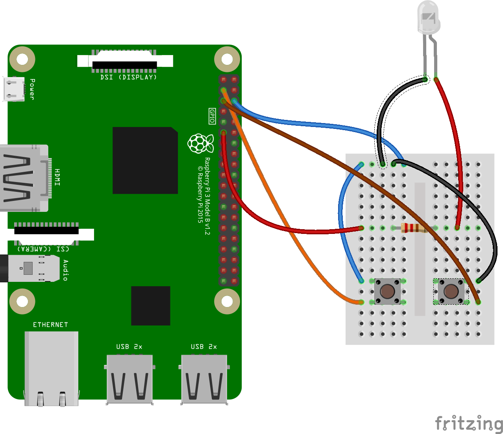

# Picroscope

## Setup



To setup the picroscope, first create a python file in `./constant.py`. The contents of the file are listed below.

``` py
# constant.py
GMAIL_USER = ""
GMAIL_PASSWORD = ""

```